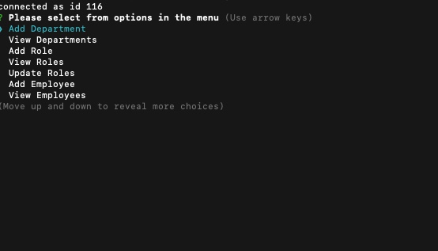

# Employee Tracker
## Description: 
Boy... this assignment was really tough, but so satisfying to complete!!! This software is created to help keep track of things like salary, departments, positions and employees for companies.
## Table Of Contents:
* How To Install
* Usage
* Technology Used/Badges
* Contributors
* Tests
* GitHub
## How To Install: 
App is launched through command line prompt "node server.js"
## Usage:
Meant for anyone who needs a solutions for the issue stated above.

 
All the choices seen in the list of the image are all the possible uses for this application.
## Technologies Used/Bagdes: 
 
## Lisence:  
MIT
## Contributors:
Edwin Genova
## Tests:
None
## GitHub: 

